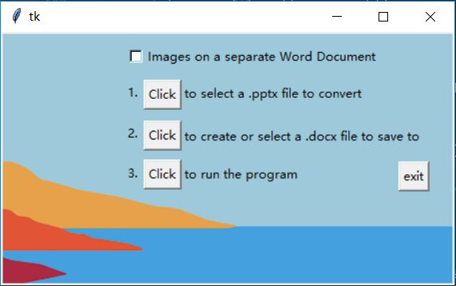

# PPT2WORD-Converter

# Try It Out
[Check out the repository.](https://github.com/kevinchen220/PPT2WORD-Converter) \
If you want to use the .exe file, you will have to put the image and the .exe file in the same folder in order for it to work. \
The same applies to main.py if you want to run it with that.
## Inspiration
Taking notes from a PowerPoint takes a lot of time and sometimes you just miss some of the information. \
Being able to convert the PowerPoint directly into a Word document not only saves time but also ensures that all information is written down.
## What it does
PPT2WORD Converter converts the uploaded PowerPoints into formatted Word documents. \
The user has the option to either have the images on the same Word document or a separate one. \
Tables and charts are not supported at the moment but it will display on the Word document which slides contain tables and charts.
## How I built it
PPT2WORD Converter is built using Python with the python-pptx and python-docx libraries. \
The GUI is made using Tkinter. 
